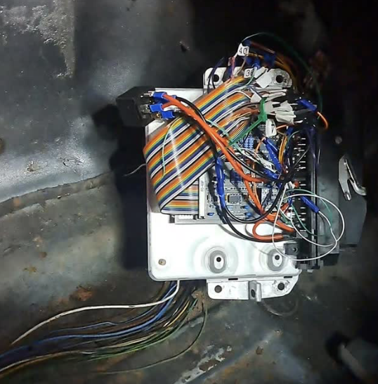

# About

This repo is a collection of diagrams, wiring plans and 3d printable models. The objective is converting a BMW E30 to use speeduino with a digital dashboard using ts-dash. This uses the original Motronic 1.3 harness to de-risk the conversion. 

Disclaimer: Anything you follow here you do at your own risk etc.

## Wiring
The only wiring modification needed so far, is a replacement injector sub-loom (later harnesses use a sub loom with a connector - see links for depin tool), and the TPS wires either needs an adapter or re-wire to work with an E36 variable TPS. I also converted the AFM plug to a generic connector though you could always make an adapter.

You can find a load of shorts and videos on progress here [https://www.youtube.com/cookracinguk](https://www.youtube.com/cookracinguk)

## Contents

These are the key items though take a look through the file list for bits and bobs. There's an initial stab at a custom harness for example.

- [Motronic pins to Speeduino map](docs/motronic-speeduino-map.md)
- [Cluster Conversion](docs/cluster.md)
- [Useful links](docs/links.md)
- [Ignition module](docs/ignition.md)

