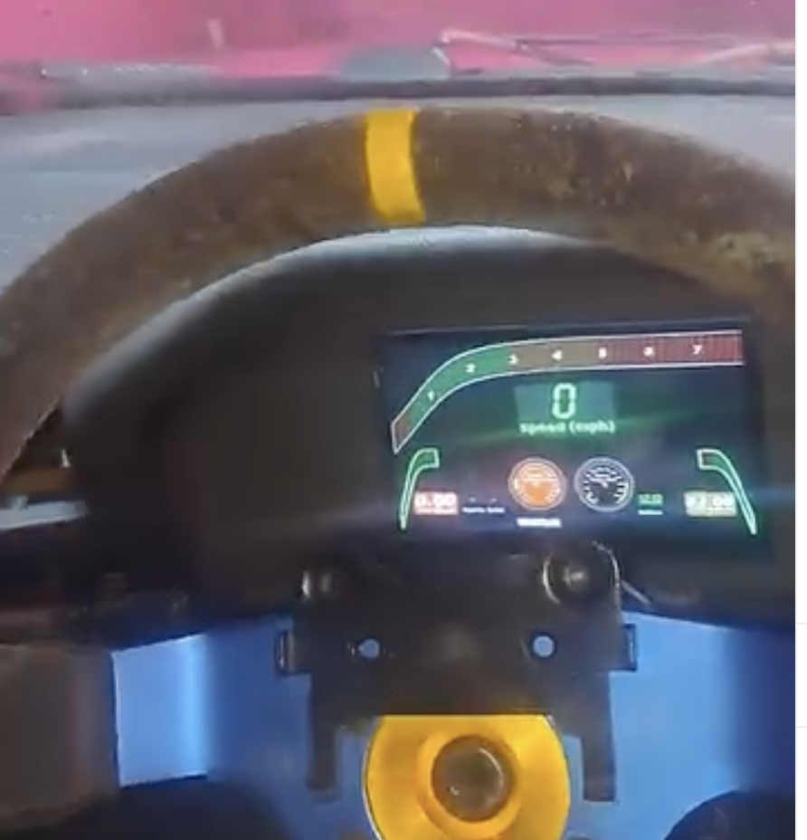
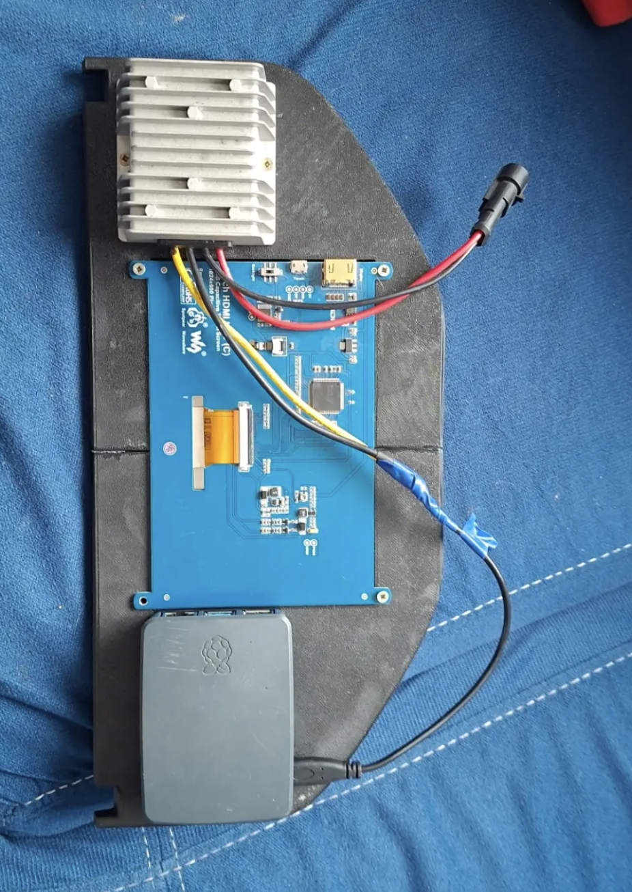
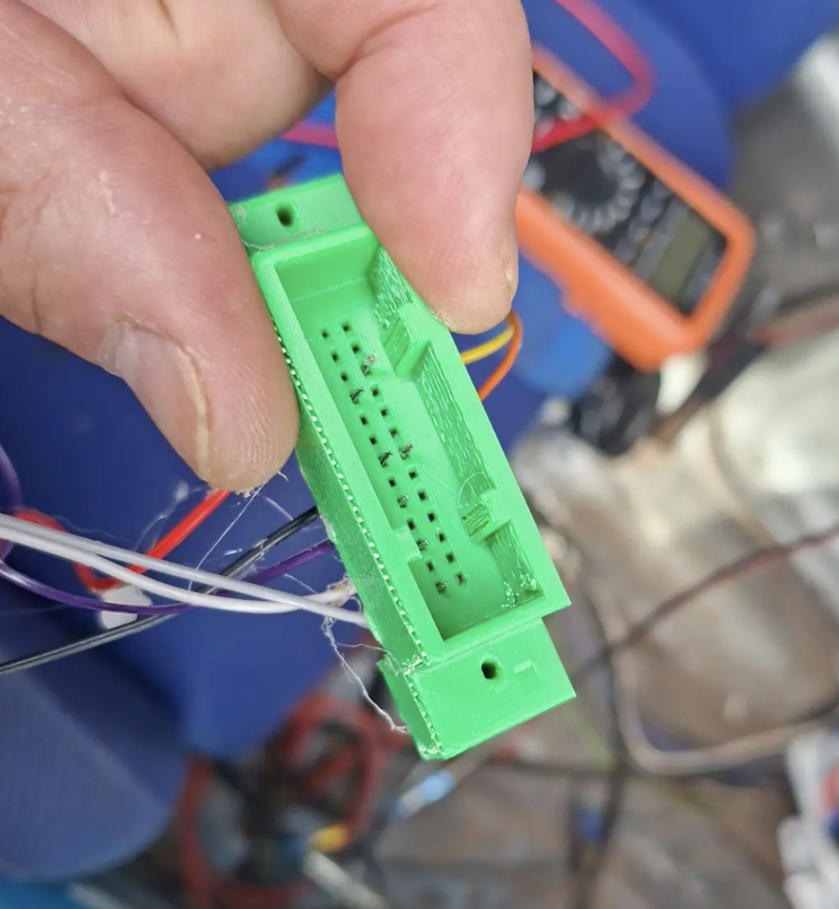
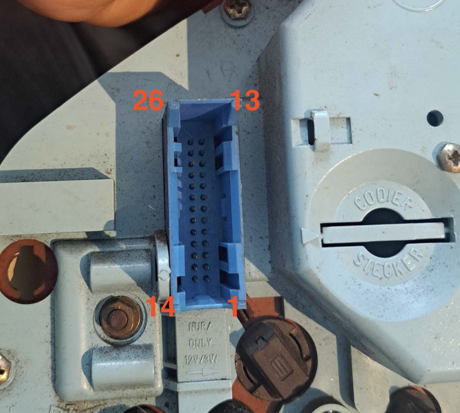
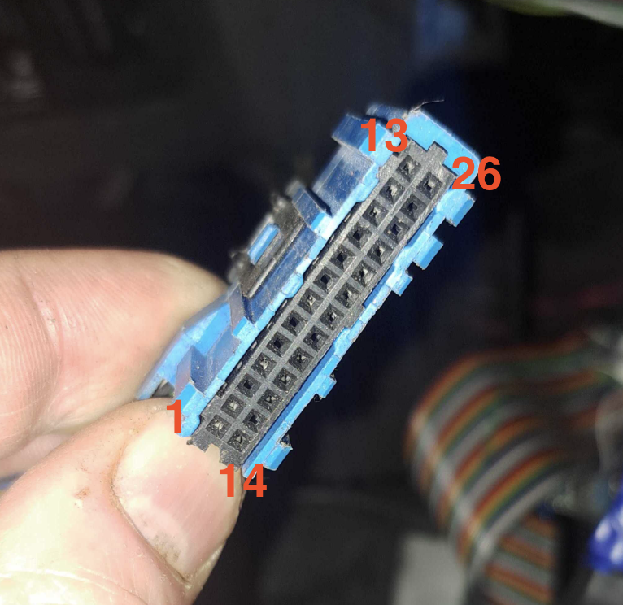

# Overview

The objective here is a ts-dash (see http://tunerstudio.com/index.php/products/ts-dash) replacement for the instrument clocks, using the standard E30 wiring.

We use a raspberry pi and lcd touch screen, and custom 3d printed dash cluster.

## Pins

https://www.e30zone.net/e30wiki/images/b/b2/Instrument_Cluster.pdf

## C1 (Blue)

There is an stl file for the connector in the stls folder. Basically it looks like below and the blue connector fits perfectly. The pins themselves are just bent dupont connectors fixed in place with a hot glue gun. Seems to work. At time of writing, more work is needed to get the locking tab to do it's job, but it certainly isn't loose.

26 Pins

- 7 Tachometer (now Speeduino USB serial date TX from Motronic pin 6) to Pi 10 RX - Orange
- 11 Fuel flow rate (now Speeduino USB serial date RX from Motronic pin 32) to Pi 8 TX - Yellow
- 14 Alternator light +
- 16 Alternator lights -
- 18 Oil  
- 20 GND
- 23 Live 12v

## C2 (White)
26 Pins

- 4 Left fuel tank sender gnd
- 5 Fuel tank sender gnd
- 8 Speed sensor
- 13 Speed sensor

## Diagrams

