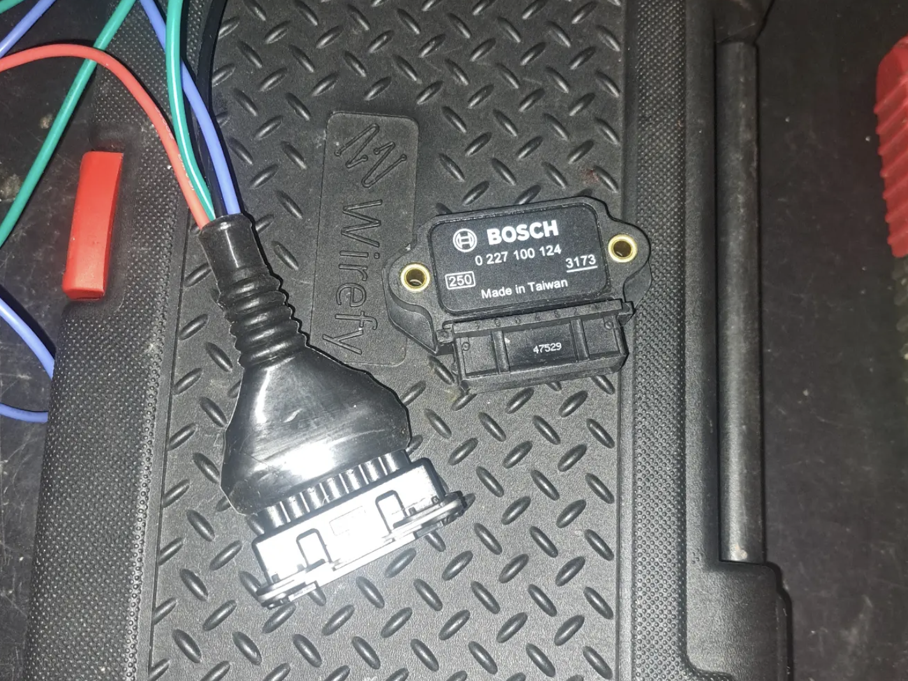
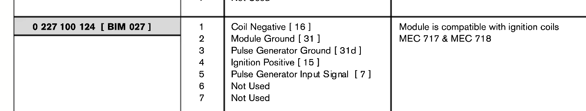
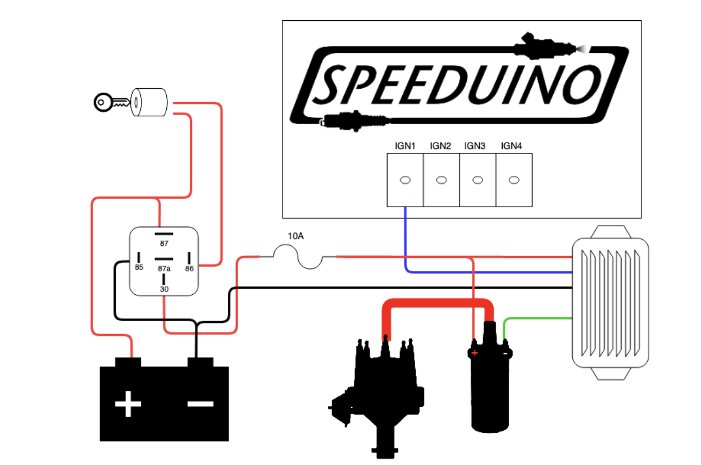
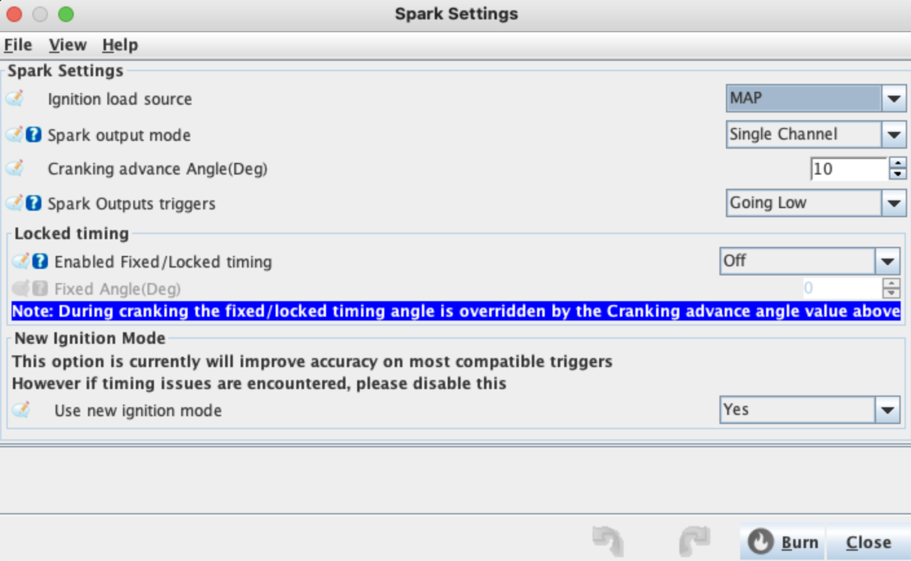

# Overview

Don't make the mistake I did. Speeduino can trigger ignition either sending signal or ground - great. The E30 ignition coil is triggered by ground - fantastic. So we can use the Speeduino in ground mode, no? Erm... no. You'll find the ignition leds on speeduino just permenantly light up and you'll have no clue why...

Turns out the ignition coil is leaking live back through this (motronic 1.3 pin #1) and confuses the hell out of speeduino, so it doesn't fire. Therefore, I use a Bosch 124 ignition module.

**Careful!** The wiring colours in this diagram don't correspond to my own, blue and green are swapped for me.

## Ignition control module wiring
- Module pin | Purpose | Wire colour | Destination
- 1 | Coil negative | Blue | Coil black
- 2 | Module ground | Black | Chassis ground
- 4 | Ignition positive | Red | Switched live |
- 5 | Pulse generator Input Signal | Green | Ignition Coil Green wire (ground) | 

## TS Settings
Take note of these TS settings:

