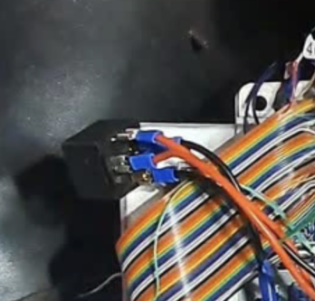

# ECU Relays

There is a relay for the speeduino (nothing special just one from Halfords).

## ECU Power relay 

See https://www.r3vlimited.com/board/forum/e30-technical-forums/engine-drivetrain/m20/338232-m20b25-fuel-pump-wiring
When 12v comes from pin 27, a new relay needs to ground pin 36. This will activate the main relay switching on power to pin 37, powering up the Speeduino

- ECU Pin - Relay pin - Destination / Description
- 27 - 86 - Ignition on 12v
- 19 - 85 - Motronic 19 (main gnd)
- 36 - 87
- 2 - 30 - Motronic 2 (gnd)