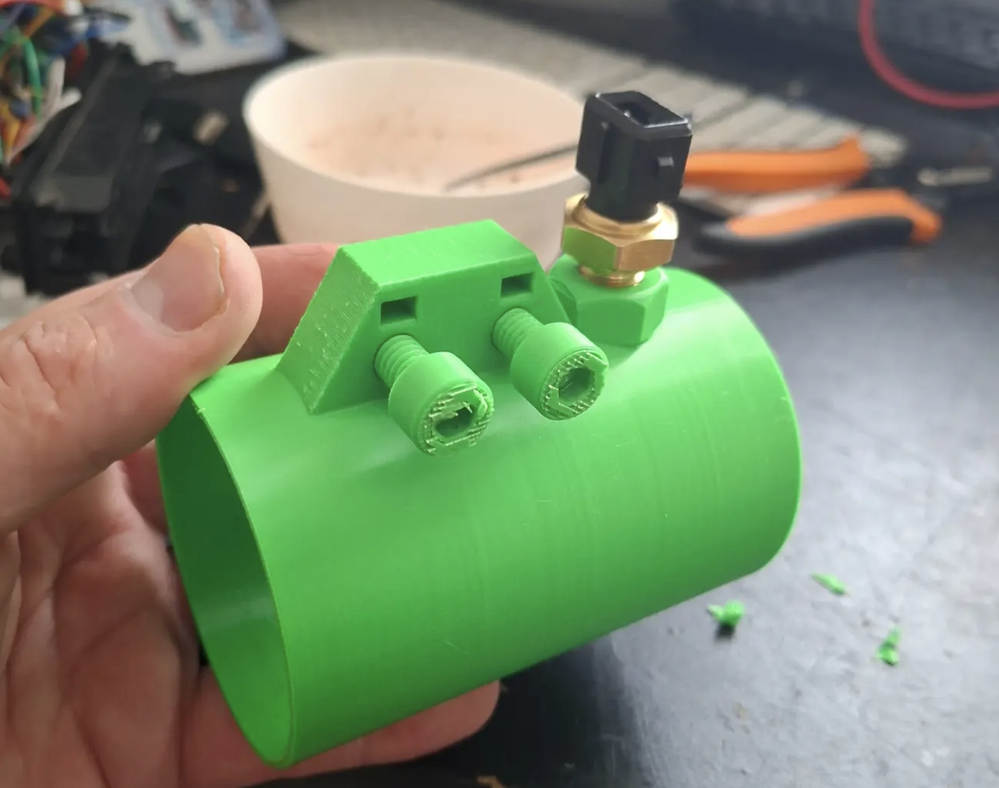

# Overview

The AFM is the whole reason I went down this rabbit hole in the first place... not that I needed much of an excuse. But the B25 engine didn't come with one. So erm.... new ECU with modern EFI, new cluster with wifi and live tuning, was clearly the solution :)

M20 AFM uses an outdated method of measure air intake - a physical door which measures how much air is pushing against it. So there's also a very small performance loss. Instead we ditch the AFM (it's also a couple of kg!), and use the Speeduino MAP sensor instead to measure intake air pressure. We also use an Intake Air Temp sensor to feed the Speeduino useful data.

# AFM Plug re-purpose
- Pin no - ECU Pin No - New purpose - Speeduino pin
- 1 - 44 - Inlet Air Temp (IAT) - 20
- 2 - 7 - Coolant (CLT) - 19
- 3 - 12 - Unused
- 4 - 26 - IAT / CLT Ground - 9

## M20 B20
AFM intake hose od 6.7cm

## Intake adapter

